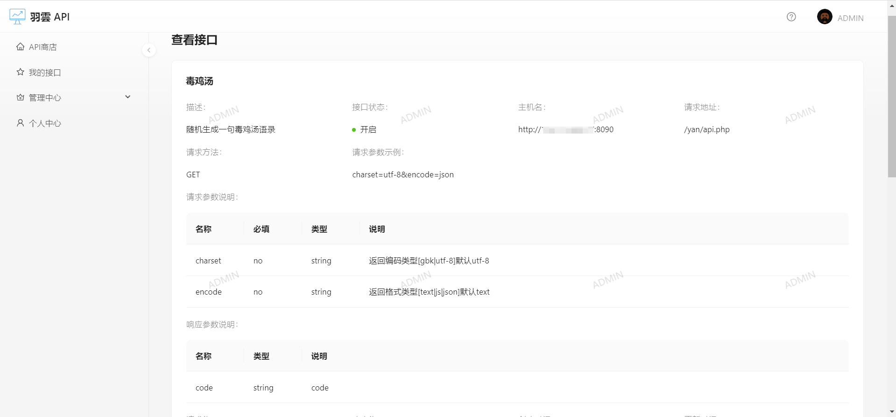

# 羽雲 API

> 一个接口调用平台，为开发者提供各种接口服务
>
> Java + React 全栈项目，包括网站前台+管理员后台，感谢[鱼厂创始人](https://github.com/liyupi)提供的项目基础框架，我也是在此基础上作拓展
>
> 项目后端开源代码：https://github.com/yunhaoyu/yuapi-backend
>
> 项目前端开源代码：https://github.com/yunhaoyu/yuapi-frontend

## 项目介绍

羽雲 API 平台初衷是尽可能地帮助和服务更多的用户和开发者， 为开发者提供API接口，提高开发者开发效率的平台。我们可以为用户提供各种类型的接口服务，使他们能够更高效地完成需求，例如：获取今日天气、获取金句、获取昵称、随机头像等服务。

项目后端使用语言为Java，包括现在市面上主流技术栈，采用微服务架构开发，解耦业务模块，前端使用React，Ant Design Pro + Ant Design组件库，使用现成组件库快速开发项目。

## 项目背景

本人大学牲一枚，作为一个菜鸡程序员，身边的前端朋友也常来问我是否可以开发一些接口可以供他们调用，或是自己难免在开发中会遇到一些简单地想法，但是可能又要花费不少时间去实现，于是乎自然就会想到有没有一些现成的API可以调用。

在搜罗了大多API网站后，发现有的接口质量参差不齐，或是收费不合理，或是速度慢，或是不符合预期，在获取之前有可能还需要进行关注公众号等操作，甚是繁琐，虽然知道有些操作合理的，但却让我萌生了一个自己写一个接口平台的想法，于是该项目诞生了。

羽雲 API 平台在开发者注册后，只需要找到需要的接口，获取接口后，使用我们提供的SDK配置密钥后就可以很方便地调用我们为您提供的服务！

## 技术栈

### 前端技术栈

- 开发框架：React、Umi
- 脚手架：Ant Design Pro
- 组件库：Ant Design、Ant Design Components
- 语法扩展：TypeScript、Less
- 打包工具：Webpack
- 代码规范：ESLint、StyleLint

### 后端技术栈

* 主语言：Java
* 框架：SpringBoot 2.7.0、Mybatis-plus、Spring Cloud
* 数据库：Mysql8.0、Redis
* 注册中心：Nacos
* 服务调用：Dubbo
* 网关：Spring Cloud  Gateway

## 快速上手

### 后端

0. **如果你在最开始不使用Nacos配置中心，那么可以将yuapi-config中的配置复制到对应模块使用**

1. 将各模块配置修改成你自己本地的端口、账号、密码

2. 启动Nacos、Mysql、Redis

服务启动顺序参考：

1. yuapi-backend
2. yuapi-interface
5. yuapi-gateway

## 功能模块

- 用户、管理员
  - 登录注册
  - 个人主页
  - 管理员：接口管理
  - 管理员：接口分析
- 接口
  - 浏览接口信息
  - 在线调用接口
  - 接口搜索

### 后端模块

* yuapi-backend：后端服务，提供用户、接口等基本操作
* yuapi-common：项目公共模块，包含一些公用的实体类，远程调用接口
* yuapi-gateway：api网关，整个后端的入口，作服务转发、用户鉴权、统一日志、服务接口调用计数
* yuapi-interface：平台提供的接口服务，目前只有简单的几个接口，大家可以自行拓展
* yuapi-client-sdk：提供给开发者的SDK
* yuapi-config：配置文件

## 系统架构

> 仅供参考

## 项目展示

* 登陆注册

* 主页

* 接口详情以及在线调用

* 我已经拥有的接口页

* 接口管理页

* 分析页

* 个人信息页

## 欢迎贡献

项目需要大家的支持，期待更多小伙伴的贡献，你可以：

* 对于项目中的Bug和建议，能够在Issues区提出建议，我会积极响应
